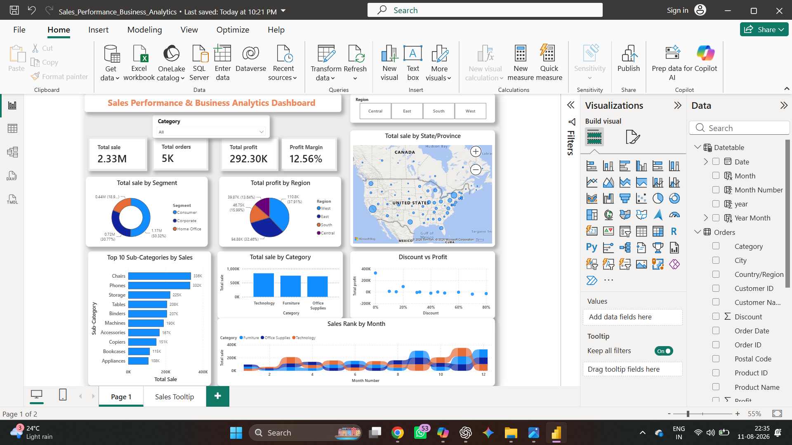

# 📊 Sales Analysis Dashboard | Power BI

## 📌 Overview

This project showcases an interactive **Sales Analysis Dashboard** created using **Microsoft Power BI**. The dashboard provides business insights into sales performance, profitability, customer segments, regional performance, and payment modes.

The objective of this dashboard is to help stakeholders monitor KPIs and make data-driven business decisions through interactive visualizations.

---

## 🚀 Dashboard Highlights

### 📈 KPIs
- Total Revenue
- Total Profit
- Total Orders
- Profit Margin

### 📊 Analysis
- Sales & Profit by Category
- Monthly Sales Trend (Year-over-Year)
- Monthly Profit Trend (Year-over-Year)
- Sales by Payment Mode
- Sales by Region
- Top Products by Sales
- Profit & Sales by Customer Segment
- Sales Distribution on Map

---

## 🛠️ Tools Used

- Microsoft Power BI
- DAX
- Power Query
- Data Modeling
- Data Visualization

---

## 📷 Dashboard Preview

The image below represents the final interactive dashboard.

---

## 💡 Skills Demonstrated

- Dashboard Design
- Business Intelligence
- KPI Reporting
- Data Visualization
- Interactive Filtering
- DAX Measures
- Data Modeling

---

## 📬 Contact

**Birendra Pratap Singh**

- GitHub: https://github.com/Birendra23
- LinkedIn: https://www.linkedin.com/in/birendra-pratap-singh-bps2618/

---

⭐ If you like this project, consider giving the repository a star!
